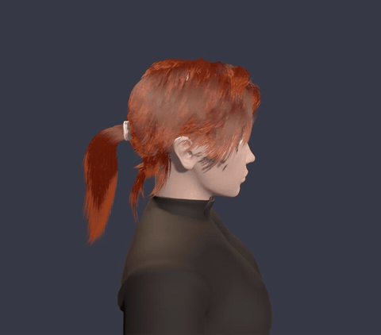

# TressFX for Godot

[](https://godotengine.org)
[](https://github.com/ismailivanov/TressFX-Godot/releases)
[](https://store.godotengine.org/asset/carbonstore/tressfx-real-time-hair-fur/)
[](LICENSE)
[](https://buymeacoffee.com/carbon06)

Real-time hair and fur for Godot 4. This is a native port of [AMD TressFX 4.1](https://github.com/GPUOpen-Effects/TressFX)
written as a GDExtension in C++: the strands are simulated on the GPU with compute shaders,
skinned to your animated `Skeleton3D`, kept out of the character's body with signed distance
fields, and drawn as thin ribbons with proper hair lighting. It runs in the editor too, so you can
tune a hairstyle while the animation plays.



<sub>Preview at reduced quality. Watch the [full video on YouTube](https://www.youtube.com/watch?v=bkSciZ1YLp8) or the [demo recording](screenshots/ponytail.mp4) (16 s).</sub>

### Video

[](https://www.youtube.com/watch?v=bkSciZ1YLp8)

### RatBoy


<sub>Both scenes ship with the addon. Captured on an RTX 4060 Ti with MSAA 4x and TAA; the video is a Movie Maker recording of the ponytail demo.</sub>

## Features

- **Three nodes and nothing else to set up.** `TressFXHair` for the hair, `TressFXCollisionMesh`
  for anything the hair must stay out of, `TressFXStats` for an on-screen cost readout. All
  three are documented in the editor's help (press F1 and search for TressFX).
- **The whole simulation on the GPU.** Velocity shock propagation, global and local shape
  constraints, length constraints, gravity, gusting wind and per-frame distance-field collision,
  straight from TressFX. The main thread spends a few microseconds per node.
- **Skinned or rigid.** Give the hair a skeleton and a `.tfxbone` file and it follows the
  animation; give it nothing and it follows the node, which is all a bust or a prop needs.
- **Colliders from any mesh.** A `CapsuleMesh`, a skinned body proxy, or a `.tfxmesh` from
  the Maya or Blender exporter. The editor draws them in the pose the simulation uses, so you can
  see where they sit inside the body; a toolbar button hides them. The distance field is rebuilt only when the collider actually moves.
- **Hair that looks like hair.** Thin tips, per-strand colour variation, body-albedo roots,
  Kajiya-Kay diffuse with two shifted Marschner highlights, distance LOD, hair shadows. No MSAA
  needed.
- **Fast to iterate.** Loading a 75,000-strand groom takes about 40 ms, so every change in the
  Inspector is instant, and the editor simulation sleeps when nothing changes.
- **Only pays for what you see.** Hair that is hidden, off screen or beyond a distance you set
  stops simulating, and colliders nobody uses are not rebuilt.
- **Groom in Blender.** The [Blender to Godot Hair](https://github.com/ismailivanov/Blender-to-Godot-Hair)
  add-on (also in `addons/tressfx/tools`) exports Blender's hair curves with strand UVs and bone
  weights, and collision meshes as `.tfxmesh`; the [Blender guide](docs/Blender.md) goes from an
  empty hair object to a skinned hairstyle in Godot.

## Quick start

1. Add a `TressFXHair` node and point `tfx_path` at a `.tfx` file. The hair appears and starts
   moving.
2. For a character, set `hair_skeleton` to its `Skeleton3D` and `tfxbone_path` to the matching
   `.tfxbone`.
3. Add a `TressFXCollisionMesh` for the head or body (a capsule is a fine start), and list it in
   the hair's `collision_meshes`.
4. Give the hair a `ShaderMaterial` that uses `addons/tressfx/shaders/tressfx_strand.gdshader`.
   Colour, fiber width and lighting live in that material.

MSAA is not needed. TAA is worth turning on: it keeps strands thinner than a pixel from flickering. The
[user guide](docs/Home.md) (also on the [wiki](https://github.com/ismailivanov/TressFX-Godot/wiki))
covers the asset formats, every parameter, tuning recipes for fur, long hair and ponytails,
performance and troubleshooting.

## Install

1. Download the [latest release](https://github.com/ismailivanov/TressFX-Godot/releases/latest)
   or install it from the [Godot Asset Store](https://store.godotengine.org/asset/carbonstore/tressfx-real-time-hair-fur/).
2. Copy `addons/tressfx` into your project. There is no plugin to enable; Godot picks up the
   `.gdextension` file on its own.
3. Open the project once so the compute shaders get imported.

The addon needs Godot 4.7 with the Forward+ or Mobile renderer. Linux, Windows and macOS
binaries are included; other platforms build from source (see below). The demos and their
assets live in `addons/tressfx/demo` and weigh about 150 MB, delete that folder if you do not
want them in your project.

## Demos

- **Ponytail** (`addons/tressfx/demo/ponytail.tscn`, the project's main scene): the TressFX 3.1
  ponytail on a bust with primitive colliders. Drag with the mouse to turn the head.
- **RatBoy** (`addons/tressfx/demo/main.tscn`): AMD's own sample character with fur and a
  mohawk skinned to the animation, colliding with the body and both hands.
- **Blender hair** (`addons/tressfx/demo/blender_hair.tscn`): a scanned head with a spiked
  mohawk that stands up and sways a little, made in Blender and exported with the add-on together
  with the head and body collision meshes.
  The Blender file is next to it (`demo/blender_hair/source/blender_hair.blend`), ready to
  change and export again.

The button in the bottom-right corner (or the N key) goes to the next demo. The scenes take
command-line flags for benchmarks and jitter checks; they are listed at the top of `main.gd`
and `bust.gd`.

## Limitations

Read this before deciding to ship it.

- **Strand edges are blended unsorted.** TressFX's order-independent transparency (ShortCut and
  PPLL) was not ported. The solid core of every strand writes depth in a pre-pass and the soft
  edges are alpha-blended over it without sorting, so where many semi-transparent edges cross,
  their layering can be slightly off. MSAA is not needed; strands thinner than a pixel still rely
  on TAA to stop flickering.
- **No deep shadow map.** TressFX's soft, volumetric hair self-shadowing was not ported; a
  root-darkening term stands in. `cast_hair_shadows` puts the hair into Godot's ordinary shadow
  maps, which shades the skin under it, but renders the hair once more per shadow cascade (the
  ponytail demo goes from 0.67 to 2.5 million triangles per frame with it on).
- **Forward+ or Mobile renderer only.** There is no `RenderingDevice` under the Compatibility
  (OpenGL) renderer, so no fallback for old hardware or the web. Mobile is untested.
- **Triangle counts are large by nature.** Every strand of `n` vertices is `2 (n - 1)`
  triangles: a 20,000-strand hairstyle at 16 vertices is 600,000 triangles, the RatBoy demo's
  82,000 strands are 1.5 million. That is how strand hair works everywhere (TressFX shipped in
  games at around 20,000 strands); the cost is fill rate, about 1 to 2 ms for such a hairstyle
  on a mid-range GPU at 1080p, and it scales with resolution.
- **GPU memory** is about 140 bytes per hair vertex: 45 MB for that 20,000-strand hairstyle,
  85 MB for the RatBoy fur, plus 4 bytes per distance field cell for each collider.
- **The simulation runs once per frame, not on a fixed timestep** (the same as TressFX). Its
  behaviour changes a little with the frame rate; the time step is clamped at 50 ms.
- **Colliders must be closed meshes**, the distance field only exists in a band around the
  surface, `num_cells_x` is capped at 128, and a groom's rest pose has to start outside its
  colliders.
- **Assets have to come from somewhere.** The addon reads TressFX's `.tfx`/`.tfxbone`/`.tfxmesh`
  and includes a Blender exporter and a Maya ASCII converter. Vertices per strand must be 4, 8,
  16, 32 or 64, and one node holds at most 16 million vertices.
- **One set of parameters per node.** A hairstyle whose parts need different stiffness or gravity
  is split into several `.tfx` files and nodes.
- **One material per node**; the node writes its simulation texture into it.
- **Binaries** are provided for Linux, Windows (x86_64) and macOS. Android would need the Mobile
  renderer and a build from source; iOS and the web are not supported.

## Development

The extension is built with [godot-cpp](https://github.com/godotengine/godot-cpp) and SCons.
Sources are in `src/`, the in-editor class reference in `doc_classes/`, and the untouched AMD
sources in `upstream/` for reference.

```bash
git clone --depth 1 https://github.com/godotengine/godot-cpp godot-cpp
scons platform=linux target=template_debug
scons platform=linux target=template_release
```

Use `platform=windows` or `platform=macos arch=universal` on those systems. The libraries land
in `addons/tressfx/bin/`. The GitHub Actions workflow builds all three platforms and packages
the addon on every push.

## AI use

An LLM was used in this project.

## Support

If TressFX for Godot saves you time, you can support the work: [Buy me a coffee](https://buymeacoffee.com/carbon06).

## License

[MIT](LICENSE) © Ismail Ivanov. The simulation, collision and shading algorithms are ported
from AMD TressFX (MIT, © Advanced Micro Devices); see `addons/tressfx/LICENSE.md`. The
ponytail model is AMD's, the RatBoy scene is AMD's sample content. The Blender hair demo's bust
is "Infinite, 3D Head Scan" by Lee Perry-Smith (Infinite-Realities), CC BY 3.0; its hairstyle
was made in Blender for this project (see `addons/tressfx/demo/blender_hair/LICENSE.txt`).
