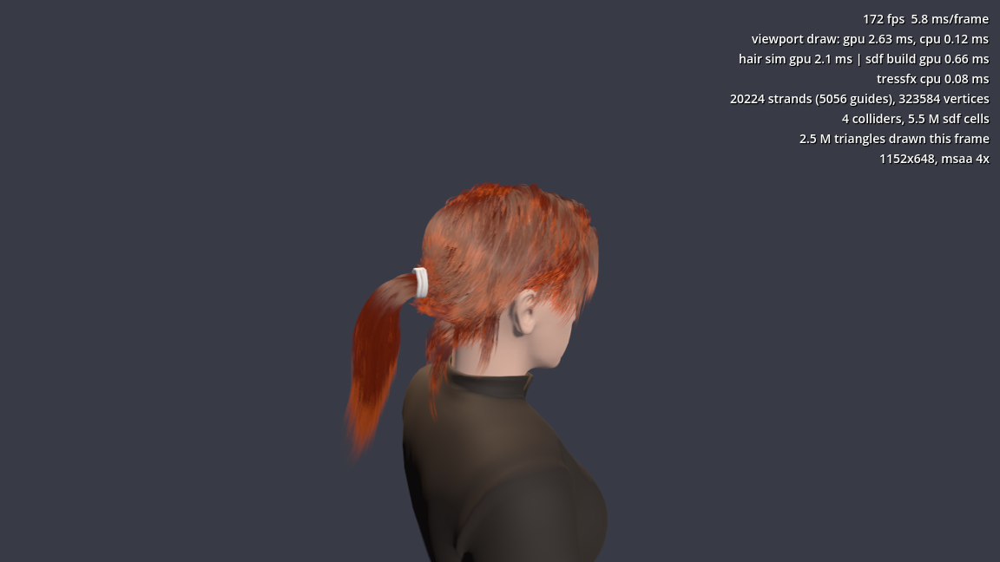
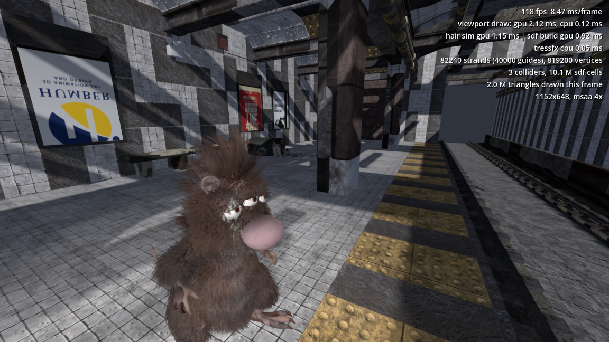

# TressFX for Godot

[](https://godotengine.org)
[](https://github.com/ismailivanov/TressFX-Godot/releases)
[](LICENSE)
[](https://buymeacoffee.com/carbon06)

Real-time hair and fur for Godot 4. This is a native port of [AMD TressFX 4.1](https://github.com/GPUOpen-Effects/TressFX)
written as a GDExtension in C++: the strands are simulated on the GPU with compute shaders,
skinned to your animated `Skeleton3D`, kept out of the character's body with signed distance
fields, and drawn as thin ribbons with proper hair lighting. It runs in the editor too, so you can
tune a hairstyle while the animation plays.



### RatBoy



<sub>Both scenes ship with the addon. Captured on an RTX 4060 Ti at 1152x648 with MSAA 4x and TAA.</sub>

## Features

- **Three nodes and nothing else to set up.** `TressFXHair` for the hair, `TressFXCollisionMesh`
  for anything the hair must stay out of, `TressFXStats` for an on-screen cost readout. All
  three are documented in the editor's help (press F1 and search for TressFX).
- **The whole simulation on the GPU.** Velocity shock propagation, global and local shape
  constraints, length constraints, gravity, gusting wind and per-frame distance-field collision,
  straight from TressFX. The main thread spends a few microseconds per node.
- **Skinned or rigid.** Give the hair a skeleton and a `.tfxbone` file and it follows the
  animation; give it nothing and it follows the node, which is all a bust or a prop needs.
- **Colliders from any mesh.** A `CapsuleMesh`, a skinned body proxy, or a `.tfxmesh` from
  the Maya exporter. The distance field is rebuilt only when the collider actually moves.
- **Hair that looks like hair.** Thin tips, per-strand colour variation, body-albedo roots,
  Kajiya-Kay diffuse with two shifted Marschner highlights, distance LOD, optional shadows.
- **Fast to iterate.** Loading a 75,000-strand groom takes about 40 ms, so every change in the
  Inspector is instant, and the editor simulation sleeps when nothing changes.

## Quick start

1. Add a `TressFXHair` node and point `tfx_path` at a `.tfx` file. The hair appears and starts
   moving.
2. For a character, set `hair_skeleton` to its `Skeleton3D` and `tfxbone_path` to the matching
   `.tfxbone`.
3. Add a `TressFXCollisionMesh` for the head or body (a capsule is a fine start), and list it in
   the hair's `collision_meshes`.
4. Give the hair a `ShaderMaterial` that uses `addons/tressfx/shaders/tressfx_strand.gdshader`.
   Colour, fiber width and lighting live in that material.

Turn on MSAA 4x and TAA in the project settings; the strands rely on both to look smooth. The
[addon README](addons/tressfx/README.md) covers the asset formats, every parameter, tuning
recipes for fur, long hair and ponytails, and the differences from the original TressFX.

## Install

1. Download the [latest release](https://github.com/ismailivanov/TressFX-Godot/releases/latest)
   or install it from the Godot Asset Library.
2. Copy `addons/tressfx` into your project. There is no plugin to enable; Godot picks up the
   `.gdextension` file on its own.
3. Open the project once so the compute shaders get imported.

The addon needs Godot 4.7 with the Forward+ or Mobile renderer. Linux, Windows and macOS
binaries are included; other platforms build from source (see below). The demos and their
assets live in `addons/tressfx/demo` and weigh about 150 MB, delete that folder if you do not
want them in your project.

## Demos

- **Ponytail** (`addons/tressfx/demo/ponytail.tscn`, the project's main scene): the TressFX 3.1
  ponytail on a bust with primitive colliders. Drag with the mouse to turn the head.
- **RatBoy** (`addons/tressfx/demo/main.tscn`): AMD's own sample character with fur and a
  mohawk skinned to the animation, colliding with the body and both hands.

Both scenes take command-line flags for benchmarks and jitter checks; they are listed at the
top of `main.gd` and `bust.gd`.

## Development

The extension is built with [godot-cpp](https://github.com/godotengine/godot-cpp) and SCons.
Sources are in `src/`, the in-editor class reference in `doc_classes/`, and the untouched AMD
sources in `upstream/` for reference.

```bash
git clone --depth 1 https://github.com/godotengine/godot-cpp godot-cpp
scons platform=linux target=template_debug
scons platform=linux target=template_release
```

Use `platform=windows` or `platform=macos arch=universal` on those systems. The libraries land
in `addons/tressfx/bin/`. The GitHub Actions workflow builds all three platforms and packages
the addon on every push.

## Support

If TressFX for Godot saves you time, you can support the work: [Buy me a coffee](https://buymeacoffee.com/carbon06).

## License

[MIT](LICENSE) © Ismail Ivanov. The simulation, collision and shading algorithms are ported
from AMD TressFX (MIT, © Advanced Micro Devices); see `addons/tressfx/LICENSE.md`. The
ponytail model is AMD's, the RatBoy scene is AMD's sample content.
